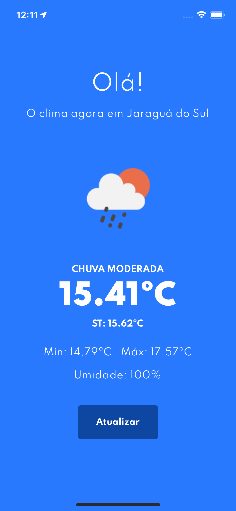
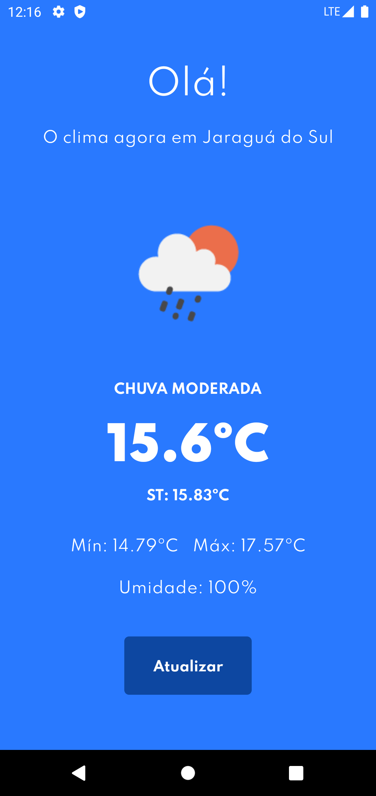

<h3 align="center">ClimaDev</h3>

<div align="center">

[]()
[](/LICENSE)

</div>

---

<p align="center"> This app is a Weather App called ClimaDev.
<br>
It's a mobile app that uses the OpenWeatherAPI.
    <br> 
</p>

## 📝 Table of Contents

- [About](#about)
- [Getting Started](#getting_started)
- [Usage](#usage)
- [Built Using](#built_using)
- [Authors](#authors)
- [TODO](#todo)

## 🧐 About <a name = "about"></a>

This project was made to be a React Native application to show your current location weather.

## 🏁 Getting Started <a name = "getting_started"></a>

These instructions will get you a copy of the project up and running on your local machine for development and testing purposes.

### Prerequisites

- [Yarn](https://yarnpkg.com/lang/en/) - Package Manager

### Installing

A step by step series of examples that tell you how to get a development env running.

### Cloning Repo

```
$ git clone https://github.com/gregorispielmann/climadev.git
```

### Mobile (:apple: iOS and :robot: Android)

### Demo

<div style="display: flex;">




</div>

### How it runs?

```
$ yarn
To install all dependencies

$ cd ios && pod install && cd ..
To install all cocoa pods dependencies

$ yarn android
To run the app in Android Emulator

$ yarn ios
To run the app in iOS Simulator
```

## 🎈 Usage <a name="usage"></a>

You will only need to give App your Location Permission.
If you want to update your data you only need to press Atualizar button.

## ⛏️ Built Using <a name = "built_using"></a>

- [React Native](https://react-native.org/) - Mobile Framework
- [Styled Components](https://www.styled-components.com/) - CSS in Javascript library
- and others

## ✍️ Authors <a name = "authors"></a>

- [@gregorispielmann](https://github.com/gregorispielmann) - Mobile App development
